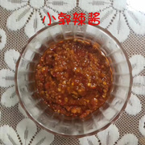

# blog
小葫芦的个人博客

## 内容

1. [Rust 语言入门](rust/README.md)

## 赞助

通过购买 **小郭辣酱** 赞助，谢谢！

1. 特色：**自家**手工制作、天然无添加；
2. 配料：红辣椒、芝麻、花生、大蒜……；
3. 价格
    1. 净重300g，售价15元人民币
    2. 扬州本地15元一瓶配送
    3. 江浙沪35元两瓶包邮
    4. 其他省份40元两瓶包邮（除个别偏远省份）
4. 微信扫码购买

   
5. 友情提醒：辣酱虽香，酌量食用。

